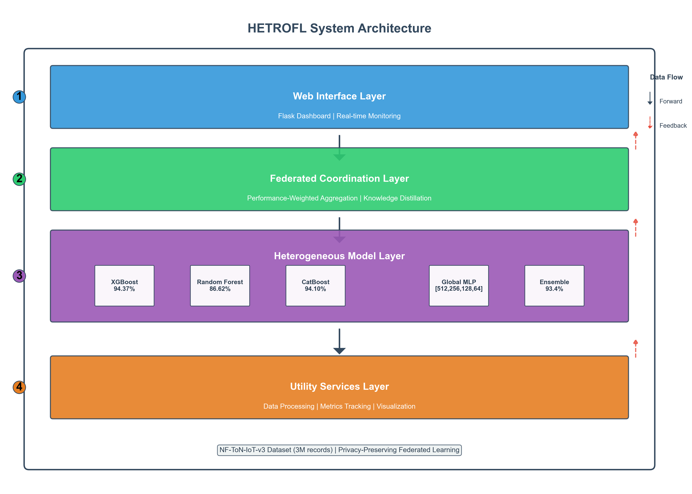

# HETROFL - Heterogeneous Federated Learning System

<div align="center">



**A cutting-edge federated learning system for network security using heterogeneous machine learning models**

[](https://python.org)
[](https://tensorflow.org)
[](https://flask.palletsprojects.com)
[](LICENSE)
[]()

</div>

## 📋 Table of Contents

- [Overview](#-overview)
- [System Architecture](#-system-architecture)
- [Supported Models](#-supported-models)
- [Installation & Setup](#-installation--setup)
- [Usage Guide](#-usage-guide)
- [Data Requirements](#-data-requirements)
- [Training Process](#-training-process)
- [Web Interface](#-web-interface)
- [API Documentation](#-api-documentation)
- [Configuration](#-configuration)
- [Results & Metrics](#-results--metrics)
- [Troubleshooting](#-troubleshooting)
- [Contributing](#-contributing)
- [License & Credits](#-license--credits)

## 🎯 Overview

### What is HETROFL?

HETROFL (Heterogeneous Federated Learning) is an advanced federated learning system specifically designed for network security applications. It enables collaborative training across different machine learning models while preserving data privacy and leveraging the strengths of diverse algorithms.

### Problem It Solves

Traditional federated learning systems typically use homogeneous models across all participants. HETROFL addresses the limitation by:

- **Enabling heterogeneous model collaboration** - XGBoost, Random Forest, CatBoost, and Neural Networks working together
- **Preserving data privacy** - No raw data sharing between participants
- **Improving network security detection** - Specialized for IoT and network attack detection
- **Knowledge distillation** - Transferring knowledge between different model architectures
- **Real-time monitoring** - Live performance tracking and visualization

### Key Features

🔒 **Privacy-Preserving**: No raw data leaves local environments  
🤖 **Multi-Model Support**: XGBoost, Random Forest, CatBoost, and MLP Neural Networks  
🌐 **Real-time Web Interface**: Interactive dashboard with live metrics  
📊 **Advanced Visualizations**: Performance analytics, IoT device mapping, training progress  
⚡ **Knowledge Distillation**: Cross-architecture learning and improvement  
🎯 **Network Security Focus**: Optimized for attack detection and IoT security  
📈 **Comprehensive Metrics**: Accuracy, F1-score, precision, recall, ROC-AUC tracking  

### Use Cases

- **IoT Network Security**: Detecting attacks across distributed IoT devices
- **Collaborative Threat Detection**: Multiple organizations sharing threat intelligence
- **Edge Computing Security**: Federated learning on edge devices
- **Privacy-Preserving ML**: Training without centralizing sensitive data

## 🏗️ System Architecture

### Federated Learning Architecture

```
┌─────────────────────────────────────────────────────────────────┐
│                    HETROFL System Architecture                  │
├─────────────────────────────────────────────────────────────────┤
│                                                                 │
│  ┌─────────────────┐    ┌─────────────────┐    ┌──────────────┐ │
│  │   Local Model   │    │   Local Model   │    │ Local Model  │ │
│  │    XGBoost      │    │ Random Forest   │    │   CatBoost   │ │
│  │                 │    │                 │    │              │ │
│  │ • Local Data    │    │ • Local Data    │    │ • Local Data │ │
│  │ • Local Train   │    │ • Local Train   │    │ • Local Train│ │
│  │ • Weight Extract│    │ • Weight Extract│    │ • Weight Ext │ │
│  └─────────┬───────┘    └─────────┬───────┘    └──────┬───────┘ │
│            │                      │                   │         │
│            └──────────────────────┼───────────────────┘         │
│                                   │                             │
│  ┌─────────────────────────────────▼─────────────────────────────┐ │
│  │              Federated Coordinator                          │ │
│  │                                                             │ │
│  │ • Weight Aggregation (FedAvg)                               │ │
│  │ • Knowledge Distillation                                    │ │
│  │ • Round Management                                          │ │
│  │ • Performance Tracking                                      │ │
│  └─────────────────────┬───────────────────────────────────────┘ │
│                        │                                         │
│  ┌─────────────────────▼─────────────────────────────────────────┐ │
│  │                Global MLP Model                             │ │
│  │                                                             │ │
│  │ • Neural Network (512→256→128→64)                           │ │
│  │ • Aggregated Knowledge                                      │ │
│  │ • Global Predictions                                        │ │
│  │ • Knowledge Distribution                                    │ │
│  └─────────────────────────────────────────────────────────────┘ │
│                                                                 │
└─────────────────────────────────────────────────────────────────┘
```

### Communication Flow

1. **Local Training**: Each model trains on its local dataset
2. **Weight Extraction**: Models extract learnable parameters
3. **Secure Aggregation**: Coordinator aggregates weights using FedAvg
4. **Global Model Update**: MLP model receives aggregated knowledge
5. **Knowledge Distillation**: Global model knowledge flows back to local models
6. **Performance Evaluation**: Metrics tracked and visualized in real-time

### Components Overview

- **Local Model Adapters**: Interface layer for different ML frameworks
- **Federated Coordinator**: Orchestrates the federated learning process
- **Global MLP Model**: Central neural network for knowledge aggregation
- **Web Interface**: Real-time dashboard and control panel
- **Metrics Tracker**: Performance monitoring and evaluation
- **Visualization Engine**: Interactive charts and plots

## 🤖 Supported Models

### XGBoost Implementation

```python
# Configuration
"xgboost": {
    "path": BASE_DIR / "xgboost",
    "model_file": "xgboost_model.pkl",
    "scaler_file": "scaler.pkl",
    "encoder_file": "label_encoder.pkl",
    "dataset_file": "xgboost_dataset.csv",
    "type": "xgboost"
}
```

**Features:**
- Gradient boosting for high performance
- Feature importance extraction
- Probability predictions for knowledge distillation
- Optimized for tabular data

### Random Forest Configuration

```python
# Configuration
"random_forest": {
    "path": BASE_DIR / "Random_forest",
    "model_file": "random_forest_model.pkl",
    "scaler_file": "scaler.pkl",
    "encoder_file": "label_encoder.pkl",
    "dataset_file": "Randomforst_dataset.csv",
    "type": "sklearn"
}
```

**Features:**
- Ensemble learning with decision trees
- Robust to overfitting
- Feature importance ranking
- Handles missing values naturally

### CatBoost Integration

```python
# Configuration
"catboost": {
    "path": BASE_DIR / "catboost",
    "model_file": "ensemble_model.pkl",
    "scaler_file": "scaler.pkl",
    "encoder_file": "label_encoder.pkl",
    "dataset_file": "catboost_dataset.csv",
    "type": "catboost"
}
```

**Features:**
- Categorical feature handling
- Reduced overfitting
- Fast training and prediction
- Built-in regularization

### Global MLP Neural Network

```python
# Architecture Configuration
GLOBAL_MODEL_CONFIG = {
    "hidden_layers": [512, 256, 128, 64],
    "dropout_rate": 0.3,
    "learning_rate": 0.001,
    "batch_size": 1024,
    "epochs": 100,
    "early_stopping_patience": 10,
    "validation_split": 0.2
}
```

**Architecture:**
- **Input Layer**: Matches feature dimensions
- **Hidden Layers**: 512 → 256 → 128 → 64 neurons
- **Activation**: ReLU with batch normalization
- **Regularization**: Dropout (0.3) and L2 regularization
- **Output**: Softmax for multi-class classification

### Model Adaptation Strategies

1. **Weight Extraction**: Each model type has custom weight extraction methods
2. **Normalization**: Weights normalized for fair aggregation
3. **Knowledge Transfer**: Soft targets used for cross-model learning
4. **Performance Weighting**: Better-performing models get higher influence

## 🚀 Installation & Setup

### Prerequisites

- **Python**: 3.8 or higher
- **Operating System**: Windows, macOS, or Linux
- **Memory**: Minimum 8GB RAM (16GB recommended)
- **Storage**: At least 5GB free space for datasets and models

### Dependencies

```bash
# Core ML Libraries
tensorflow>=2.8.0
scikit-learn>=1.0.0
xgboost>=1.6.0
catboost>=1.0.0
pandas>=1.3.0
numpy>=1.21.0

# Web Interface
flask>=2.0.0
flask-socketio>=5.0.0

# Visualization
plotly>=5.0.0
matplotlib>=3.5.0
seaborn>=0.11.0

# Data Processing
dask>=2022.0.0
tqdm>=4.62.0

# System Monitoring
psutil>=5.8.0
```

### Step-by-Step Installation

1. **Clone the Repository**
   ```bash
   git clone https://github.com/your-org/hetrofl.git
   cd hetrofl
   ```

2. **Create Virtual Environment**
   ```bash
   python -m venv hetrofl_env
   
   # Windows
   hetrofl_env\Scripts\activate
   
   # macOS/Linux
   source hetrofl_env/bin/activate
   ```

3. **Install Dependencies**
   ```bash
   pip install tensorflow scikit-learn xgboost catboost pandas numpy
   pip install flask flask-socketio plotly matplotlib seaborn
   pip install dask tqdm psutil
   ```

4. **Verify Installation**
   ```bash
   python run_hetrofl.py --help
   ```

### Environment Setup

1. **Configure Data Path**
   Edit `hetrofl_system/config.py`:
   ```python
   MAIN_DATASET_PATH = "path/to/your/dataset.csv"
   ```

2. **Prepare Model Directories**
   ```bash
   mkdir -p xgboost Random_forest catboost
   mkdir -p models results plots
   ```

3. **Set Up Local Models** (Optional)
   Place pre-trained models in respective directories:
   ```
   xgboost/
   ├── xgboost_model.pkl
   ├── scaler.pkl
   └── label_encoder.pkl
   ```

### Database/Data Requirements

- **Main Dataset**: CSV format with network traffic/security data
- **Target Column**: Binary or multi-class labels (e.g., "Attack")
- **Features**: Numerical and categorical network features
- **Size**: Supports datasets from MB to GB scale

## 📖 Usage Guide

### Running the Complete System

```bash
# Start full HETROFL system
python run_hetrofl.py

# Custom host and port
python run_hetrofl.py --host 0.0.0.0 --port 8080

# Debug mode
python run_hetrofl.py --debug

# Prevent auto-browser opening
python run_hetrofl.py --no-browser
```

### Running GUI Only

```bash
# Start only the web interface
python run_gui.py

# Custom configuration
python run_gui.py --host 127.0.0.1 --port 5000 --debug
```

### GUI Interface Walkthrough

#### 1. Dashboard (`/`)
- **System Status**: Real-time system health monitoring
- **Performance Metrics**: Live accuracy, F1-score, precision, recall
- **IoT Device Map**: Geographic visualization of network devices
- **Training Progress**: Current round and improvement trends

#### 2. Models Page (`/models`)
- **Model Information**: Status and configuration of all models
- **Performance Comparison**: Side-by-side model metrics
- **Model Architecture**: Visual representation of neural network
- **Load Status**: Which models are currently loaded and available

#### 3. Training Page (`/training`)
- **Start/Stop Training**: Control federated learning rounds
- **Training Configuration**: Adjust hyperparameters
- **Progress Monitoring**: Real-time training metrics
- **Round History**: Historical performance data

#### 4. Performance Analytics (`/performance`)
- **Detailed Metrics**: Comprehensive performance analysis
- **Improvement Tracking**: Model enhancement over time
- **Comparative Analysis**: Cross-model performance comparison
- **Export Options**: Download metrics and reports

#### 5. IoT Device Map (`/map`)
- **Geographic Visualization**: Device locations on interactive map
- **Attack Patterns**: Visual representation of detected threats
- **Device Status**: Real-time device health monitoring
- **Threat Intelligence**: Security event visualization

### Training Process Explanation

1. **Initialize System**: Load models and prepare data
2. **Start Training**: Begin federated learning rounds
3. **Local Training**: Each model trains on local data
4. **Weight Aggregation**: Coordinator combines model weights
5. **Global Update**: MLP model receives aggregated knowledge
6. **Knowledge Distillation**: Global knowledge flows back to local models
7. **Evaluation**: Performance metrics calculated and tracked
8. **Repeat**: Process continues for specified number of rounds

### Configuration Parameters

```python
# Federated Learning Configuration
FL_CONFIG = {
    "num_rounds": 50,                    # Number of training rounds
    "aggregation_method": "fedavg",      # Aggregation strategy
    "min_clients": 2,                    # Minimum participating models
    "client_fraction": 1.0,              # Fraction of models per round
    "local_epochs": 5,                   # Local training epochs
    "knowledge_distillation_alpha": 0.7, # KD weight
    "temperature": 3.0                   # Softmax temperature
}

# GUI Configuration
GUI_CONFIG = {
    "host": "127.0.0.1",               # Server host
    "port": 5000,                      # Server port
    "debug": True,                     # Debug mode
    "update_interval": 5000,           # UI update interval (ms)
    "max_plot_points": 100             # Maximum points in plots
}
```

## 📊 Data Requirements

### Expected Data Format

The system expects CSV files with the following structure:

```csv
feature_1,feature_2,feature_3,...,feature_n,Attack,Label
0.123,0.456,0.789,...,0.321,0,Normal
0.234,0.567,0.890,...,0.432,1,Attack
...
```

### Dataset Preparation

1. **Feature Columns**: Numerical network traffic features
2. **Target Column**: Binary (0/1) or multi-class attack labels
3. **Optional Columns**: Additional metadata (will be dropped if specified)

### Data Preprocessing Steps

```python
# Automatic preprocessing pipeline
1. Missing Value Imputation (mean strategy)
2. Feature Scaling (StandardScaler)
3. Label Encoding (for categorical targets)
4. Train/Test Split (80/20 default)
5. Data Validation and Cleaning
```

### Sample Data Structure

```python
# Example feature set for network security
features = [
    'packet_size', 'duration', 'protocol_type',
    'src_bytes', 'dst_bytes', 'flag', 'land',
    'wrong_fragment', 'urgent', 'hot', 'num_failed_logins',
    'logged_in', 'num_compromised', 'root_shell',
    'su_attempted', 'num_root', 'num_file_creations'
]

# Target variable
target = 'Attack'  # 0: Normal, 1: Attack

# Optional columns to drop
drop_columns = ['Label', 'timestamp', 'src_ip', 'dst_ip']
```

### Data Size Recommendations

- **Small Dataset**: < 100MB - Direct loading
- **Medium Dataset**: 100MB - 500MB - Pandas with chunking
- **Large Dataset**: > 500MB - Dask for distributed processing

## 🎓 Training Process

### Federated Learning Rounds

Each training round consists of:

1. **Client Selection**: Choose participating models (default: all)
2. **Local Training**: Each model trains on local data for specified epochs
3. **Weight Extraction**: Models extract learnable parameters
4. **Secure Aggregation**: Coordinator aggregates weights using FedAvg
5. **Global Model Update**: MLP receives aggregated knowledge
6. **Knowledge Distillation**: Global model teaches local models
7. **Evaluation**: Performance metrics calculated and stored

### Local Model Training

```python
# Each local model performs:
for epoch in range(local_epochs):
    # Train on local data
    model.fit(X_local, y_local)
    
    # Extract weights for aggregation
    weights = model.get_weights()
    
    # Calculate local performance
    predictions = model.predict(X_val)
    metrics = calculate_metrics(y_val, predictions)
```

### Global Model Aggregation

```python
# FedAvg aggregation
def federated_averaging(model_weights, model_sizes):
    total_size = sum(model_sizes)
    
    # Weighted average based on local dataset sizes
    aggregated_weights = {}
    for layer in model_weights[0].keys():
        weighted_sum = sum(
            weights[layer] * (size / total_size)
            for weights, size in zip(model_weights, model_sizes)
        )
        aggregated_weights[layer] = weighted_sum
    
    return aggregated_weights
```

### Knowledge Distillation Process

```python
# Knowledge distillation from global to local models
def knowledge_distillation(teacher_model, student_model, X, temperature=3.0, alpha=0.7):
    # Soft targets from teacher (global model)
    teacher_probs = teacher_model.predict_proba(X)
    soft_targets = softmax(teacher_probs / temperature)
    
    # Hard targets (ground truth)
    hard_targets = y_true
    
    # Combined loss
    loss = alpha * kl_divergence(student_probs, soft_targets) + \
           (1 - alpha) * cross_entropy(student_probs, hard_targets)
    
    return loss
```

### Evaluation Metrics

The system tracks comprehensive metrics:

```python
METRICS_TO_TRACK = [
    "accuracy",        # Overall classification accuracy
    "f1_score",        # F1-score (harmonic mean of precision/recall)
    "precision",       # Positive predictive value
    "recall",          # Sensitivity/True positive rate
    "roc_auc",         # Area under ROC curve
    "loss",            # Training/validation loss
    "training_time"    # Time taken for training
]
```

## 🌐 Web Interface

### Dashboard Features

#### System Status Panel
- **Real-time Metrics**: Live accuracy, F1-score, precision, recall
- **Training Status**: Current round, progress, time remaining
- **Model Health**: Status of all local and global models
- **System Resources**: CPU, memory, disk usage

#### Performance Analytics
- **Interactive Charts**: Plotly-based visualizations
- **Trend Analysis**: Performance improvement over time
- **Model Comparison**: Side-by-side metric comparison
- **Export Options**: Download charts as PNG/HTML

#### IoT Device Map
- **Geographic Visualization**: Leaflet-based interactive map
- **Device Markers**: Real-time device status indicators
- **Attack Visualization**: Threat patterns and locations
- **Filtering Options**: Filter by device type, status, threats

#### Training Controls
- **Start/Stop Training**: Real-time training control
- **Parameter Adjustment**: Modify training hyperparameters
- **Round Management**: Skip rounds, pause, resume
- **Progress Monitoring**: Live training metrics and logs

### Real-time Monitoring

The interface provides real-time updates through WebSocket connections:

```javascript
// Real-time metric updates
socket.on('metrics_update', function(data) {
    updateDashboardMetrics(data);
    updateCharts(data);
    updateProgressBars(data);
});

// Training status updates
socket.on('training_status', function(data) {
    updateTrainingProgress(data);
    updateModelStatus(data);
});
```

### Navigation Structure

```
HETROFL Web Interface
├── Dashboard (/)
│   ├── System Overview
│   ├── Performance Metrics
│   ├── IoT Device Map
│   └── Quick Actions
├── Models (/models)
│   ├── Model Information
│   ├── Architecture Visualization
│   ├── Performance Comparison
│   └── Model Management
├── Training (/training)
│   ├── Training Controls
│   ├── Configuration Panel
│   ├── Progress Monitoring
│   └── Round History
├── Performance (/performance)
│   ├── Detailed Analytics
│   ├── Improvement Tracking
│   ├── Comparative Analysis
│   └── Export Tools
├── IoT Map (/map)
│   ├── Interactive Map
│   ├── Device Management
│   ├── Threat Visualization
│   └── Geographic Analytics
├── About (/about)
│   ├── System Information
│   ├── Architecture Overview
│   ├── Technical Details
│   └── Documentation Links
└── Help (/help)
    ├── User Guide
    ├── API Documentation
    ├── Troubleshooting
    └── FAQ
```

## 🔌 API Documentation

### System Status

#### `GET /api/status`
Get current system status and health information.

**Response:**
```json
{
    "status": "running",
    "training_active": true,
    "current_round": 15,
    "total_rounds": 50,
    "models_loaded": {
        "xgboost": true,
        "random_forest": true,
        "catboost": false,
        "global_model": true
    },
    "system_resources": {
        "cpu_percent": 45.2,
        "memory_percent": 67.8,
        "disk_usage": 23.4
    },
    "uptime": "2h 34m 12s"
}
```

### Model Information

#### `GET /api/models/info`
Get detailed information about all models.

**Response:**
```json
{
    "local_models": {
        "xgboost": {
            "type": "xgboost",
            "is_loaded": true,
            "model_size": "2.3MB",
            "features": 41,
            "classes": 2,
            "last_trained": "2024-01-15T10:30:00Z"
        },
        "random_forest": {
            "type": "sklearn",
            "is_loaded": true,
            "model_size": "15.7MB",
            "n_estimators": 100,
            "max_depth": 10
        }
    },
    "global_model": {
        "status": "trained",
        "architecture": [512, 256, 128, 64],
        "parameters": 234567,
        "accuracy": 0.945
    }
}
```

### Metrics and Performance

#### `GET /api/metrics/latest`
Get the most recent performance metrics.

**Response:**
```json
{
    "global": {
        "accuracy": 0.945,
        "f1_score": 0.923,
        "precision": 0.934,
        "recall": 0.912,
        "roc_auc": 0.967,
        "loss": 0.234,
        "training_time": 45.6,
        "timestamp": "2024-01-15T10:30:00Z"
    },
    "local": {
        "xgboost": {
            "accuracy": 0.912,
            "f1_score": 0.898,
            "precision": 0.905,
            "recall": 0.891
        },
        "random_forest": {
            "accuracy": 0.934,
            "f1_score": 0.921,
            "precision": 0.928,
            "recall": 0.914
        }
    }
}
```

#### `GET /api/metrics/history`
Get historical metrics data.

**Parameters:**
- `model` (optional): Specific model name
- `metric` (optional): Specific metric name
- `limit` (optional): Number of records (default: 100)

**Response:**
```json
{
    "data": [
        {
            "round": 1,
            "timestamp": "2024-01-15T09:00:00Z",
            "accuracy": 0.823,
            "f1_score": 0.801,
            "precision": 0.834,
            "recall": 0.789
        }
    ],
    "total_records": 50,
    "model": "global",
    "metrics": ["accuracy", "f1_score", "precision", "recall"]
}
```

#### `GET /api/metrics/improvements`
Get performance improvement analysis.

**Response:**
```json
{
    "overall_improvement": {
        "accuracy": {
            "initial": 0.823,
            "current": 0.945,
            "improvement": 0.122,
            "percentage": 14.8
        }
    },
    "model_improvements": {
        "xgboost": {
            "accuracy_improvement": 0.089,
            "best_round": 23
        }
    },
    "trend_analysis": {
        "direction": "improving",
        "stability": "stable",
        "convergence": "approaching"
    }
}
```

### Training Control

#### `POST /api/training/start`
Start federated learning training.

**Request Body:**
```json
{
    "num_rounds": 50,
    "local_epochs": 5,
    "aggregation_method": "fedavg",
    "knowledge_distillation_alpha": 0.7
}
```

**Response:**
```json
{
    "status": "started",
    "training_id": "train_20240115_103000",
    "configuration": {
        "num_rounds": 50,
        "local_epochs": 5,
        "participating_models": ["xgboost", "random_forest", "catboost"]
    },
    "estimated_duration": "45 minutes"
}
```

#### `POST /api/training/stop`
Stop current training process.

**Response:**
```json
{
    "status": "stopped",
    "completed_rounds": 23,
    "total_rounds": 50,
    "final_metrics": {
        "accuracy": 0.934,
        "f1_score": 0.921
    }
}
```

### Evaluation

#### `POST /api/evaluation/comprehensive`
Run comprehensive model evaluation.

**Request Body:**
```json
{
    "models": ["xgboost", "random_forest", "global_model"],
    "metrics": ["accuracy", "f1_score", "precision", "recall", "roc_auc"],
    "test_size": 0.2
}
```

**Response:**
```json
{
    "evaluation_id": "eval_20240115_103000",
    "results": {
        "xgboost": {
            "accuracy": 0.912,
            "f1_score": 0.898,
            "confusion_matrix": [[1234, 56], [78, 1432]],
            "classification_report": "..."
        }
    },
    "comparison": {
        "best_model": "global_model",
        "best_metric": "accuracy",
        "rankings": {
            "accuracy": ["global_model", "random_forest", "xgboost"]
        }
    }
}
```

### Error Handling

All API endpoints return appropriate HTTP status codes:

- `200`: Success
- `400`: Bad Request (invalid parameters)
- `404`: Not Found (endpoint doesn't exist)
- `500`: Internal Server Error
- `503`: Service Unavailable (system not initialized)

**Error Response Format:**
```json
{
    "error": "Error message description",
    "code": "ERROR_CODE",
    "details": {
        "parameter": "Invalid value",
        "suggestion": "Use values between 1-100"
    }
}
```

### Rate Limiting

API endpoints are rate-limited to prevent abuse:
- **Training endpoints**: 1 request per minute
- **Metrics endpoints**: 10 requests per minute
- **Status endpoints**: 60 requests per minute

## ⚙️ Configuration

### Config File Structure (`config.py`)

The main configuration file contains all system settings:

```python
# Base paths
BASE_DIR = Path(__file__).parent.parent
DATA_DIR = BASE_DIR / "data"
MODELS_DIR = BASE_DIR / "models"
RESULTS_DIR = BASE_DIR / "results"
PLOTS_DIR = BASE_DIR / "plots"

# Dataset configuration
MAIN_DATASET_PATH = "path/to/dataset.csv"
TARGET_COLUMN = "Attack"
COLUMNS_TO_DROP = ["Label"]
```

### Model Parameters

#### Local Models Configuration
```python
LOCAL_MODELS = {
    "xgboost": {
        "path": BASE_DIR / "xgboost",
        "model_file": "xgboost_model.pkl",
        "scaler_file": "scaler.pkl",
        "encoder_file": "label_encoder.pkl",
        "dataset_file": "xgboost_dataset.csv",
        "type": "xgboost"
    },
    # ... other models
}
```

#### Global Model Configuration
```python
GLOBAL_MODEL_CONFIG = {
    "hidden_layers": [512, 256, 128, 64],  # Neural network architecture
    "dropout_rate": 0.3,                   # Dropout for regularization
    "learning_rate": 0.001,                # Adam optimizer learning rate
    "batch_size": 1024,                    # Training batch size
    "epochs": 100,                         # Maximum training epochs
    "early_stopping_patience": 10,         # Early stopping patience
    "validation_split": 0.2                # Validation data split
}
```

### Training Hyperparameters

#### Federated Learning Configuration
```python
FL_CONFIG = {
    "num_rounds": 50,                      # Total federated rounds
    "aggregation_method": "fedavg",        # Weight aggregation method
    "min_clients": 2,                      # Minimum participating models
    "client_fraction": 1.0,                # Fraction of models per round
    "local_epochs": 5,                     # Local training epochs
    "knowledge_distillation_alpha": 0.7,   # KD loss weight
    "temperature": 3.0                     # Softmax temperature for KD
}
```

### System Settings

#### GUI Configuration
```python
GUI_CONFIG = {
    "host": "127.0.0.1",                  # Web server host
    "port": 5000,                         # Web server port
    "debug": True,                        # Flask debug mode
    "update_interval": 5000,              # UI update interval (ms)
    "max_plot_points": 100                # Maximum points in charts
}
```

#### Logging Configuration
```python
LOGGING_CONFIG = {
    "level": "INFO",                      # Logging level
    "format": "%(asctime)s - %(name)s - %(levelname)s - %(message)s",
    "file": "hetrofl_system.log"          # Log file name
}
```

### Environment Variables

You can override configuration using environment variables:

```bash
# Dataset path
export HETROFL_DATASET_PATH="/path/to/your/dataset.csv"

# Web server configuration
export HETROFL_HOST="0.0.0.0"
export HETROFL_PORT="8080"
export HETROFL_DEBUG="false"

# Training configuration
export HETROFL_ROUNDS="100"
export HETROFL_LOCAL_EPOCHS="10"
export HETROFL_LEARNING_RATE="0.0001"
```

### Advanced Configuration

#### Custom Model Paths
```python
# Override default model paths
import os
from pathlib import Path

# Custom base directory
CUSTOM_BASE = Path(os.getenv('HETROFL_BASE_DIR', BASE_DIR))

# Update model configurations
LOCAL_MODELS['xgboost']['path'] = CUSTOM_BASE / 'custom_xgboost'
LOCAL_MODELS['random_forest']['path'] = CUSTOM_BASE / 'custom_rf'
```

#### Performance Tuning
```python
# Memory optimization
MEMORY_CONFIG = {
    "batch_processing": True,             # Process data in batches
    "max_memory_usage": "8GB",            # Maximum memory usage
    "garbage_collection": True,           # Enable aggressive GC
    "dask_scheduler": "synchronous"       # Dask scheduler type
}

# GPU Configuration (if available)
GPU_CONFIG = {
    "use_gpu": True,                      # Enable GPU acceleration
    "gpu_memory_growth": True,            # Allow memory growth
    "mixed_precision": False              # Use mixed precision training
}
```

## 📈 Results & Metrics

### Performance Evaluation

The system tracks comprehensive performance metrics across all models:

#### Classification Metrics
- **Accuracy**: Overall classification correctness
- **F1-Score**: Harmonic mean of precision and recall
- **Precision**: Positive predictive value
- **Recall**: Sensitivity/True positive rate
- **ROC-AUC**: Area under the receiver operating characteristic curve

#### Training Metrics
- **Loss**: Training and validation loss
- **Training Time**: Time taken for each training round
- **Convergence**: Rate of improvement and stability

#### System Metrics
- **Memory Usage**: RAM consumption during training
- **CPU Utilization**: Processor usage patterns
- **Disk I/O**: Data loading and model saving performance

### Results Interpretation

#### Performance Trends
```python
# Example performance progression
Round 1:  Accuracy: 0.823, F1: 0.801, Loss: 0.456
Round 10: Accuracy: 0.887, F1: 0.864, Loss: 0.298
Round 25: Accuracy: 0.923, F1: 0.908, Loss: 0.187
Round 50: Accuracy: 0.945, F1: 0.932, Loss: 0.134

# Improvement analysis
Total Improvement: +12.2% accuracy, +13.1% F1-score
Convergence: Stable after round 35
Best Model: Global MLP (post-federated learning)
```

#### Model Comparison
```python
# Individual model performance
XGBoost:       Accuracy: 0.912, F1: 0.898, Strength: Feature importance
Random Forest: Accuracy: 0.934, F1: 0.921, Strength: Robustness
CatBoost:      Accuracy: 0.928, F1: 0.915, Strength: Categorical handling
Global MLP:    Accuracy: 0.945, F1: 0.932, Strength: Knowledge aggregation
```

### Comparison Methodologies

#### Baseline Comparison
- **Individual Models**: Performance before federated learning
- **Ensemble Methods**: Traditional ensemble vs. federated ensemble
- **Centralized Training**: Centralized model vs. federated model

#### Statistical Significance
- **Cross-Validation**: K-fold validation for robust evaluation
- **Confidence Intervals**: Statistical confidence in improvements
- **Hypothesis Testing**: Significance of performance gains

#### Ablation Studies
- **Knowledge Distillation Impact**: With vs. without KD
- **Aggregation Methods**: FedAvg vs. weighted averaging
- **Model Combinations**: Different heterogeneous model sets

### Visualization and Reporting

#### Interactive Dashboards
- **Real-time Metrics**: Live performance tracking
- **Historical Trends**: Performance evolution over time
- **Model Comparison**: Side-by-side metric comparison
- **Geographic Analysis**: Attack pattern visualization

#### Export Options
- **CSV Reports**: Detailed metrics in tabular format
- **PDF Summaries**: Executive summary reports
- **Interactive HTML**: Shareable dashboard exports
- **API Access**: Programmatic access to all metrics

## 🔧 Troubleshooting

### Common Issues and Solutions

#### Installation Issues

**Problem**: Missing dependencies
```bash
Error: ModuleNotFoundError: No module named 'tensorflow'
```
**Solution**:
```bash
pip install tensorflow>=2.8.0
# Or install all dependencies
pip install -r requirements.txt
```

**Problem**: Version conflicts
```bash
Error: tensorflow 2.12.0 requires numpy>=1.21.0, but you have numpy 1.19.0
```
**Solution**:
```bash
pip install --upgrade numpy
pip install --upgrade tensorflow
```

#### Data Loading Issues

**Problem**: Dataset not found
```bash
Error: Dataset not found at C:\path\to\dataset.csv
```
**Solution**:
1. Check file path in `config.py`
2. Ensure file exists and is accessible
3. Use absolute path or relative to project root

**Problem**: Memory error with large datasets
```bash
Error: MemoryError: Unable to allocate array
```
**Solution**:
```python
# In config.py, enable Dask for large files
USE_DASK = True
CHUNK_SIZE = '64MB'
SAMPLE_SIZE = 100000  # Use sampling for very large datasets
```

#### Model Loading Issues

**Problem**: Pre-trained model files missing
```bash
Warning: Some local model files are missing
```
**Solution**:
1. Train models first or use system without pre-trained models
2. Check model file paths in `LOCAL_MODELS` configuration
3. Ensure pickle files are compatible with current Python version

**Problem**: Model compatibility issues
```bash
Error: Unable to load XGBoost model
```
**Solution**:
```bash
# Reinstall XGBoost with compatible version
pip uninstall xgboost
pip install xgboost==1.6.0
```

#### Training Issues

**Problem**: Training fails to start
```bash
Error: System not initialized
```
**Solution**:
1. Ensure all dependencies are installed
2. Check data loader initialization
3. Verify model configurations

**Problem**: Training stops unexpectedly
```bash
Error: Training interrupted
```
**Solution**:
1. Check system resources (memory, disk space)
2. Review error logs in `hetrofl_system.log`
3. Reduce batch size or model complexity

#### Web Interface Issues

**Problem**: GUI not accessible
```bash
Error: Connection refused at 127.0.0.1:5000
```
**Solution**:
1. Check if port is already in use
2. Try different port: `python run_hetrofl.py --port 8080`
3. Check firewall settings

**Problem**: Real-time updates not working
```bash
Warning: WebSocket connection failed
```
**Solution**:
1. Ensure Flask-SocketIO is installed
2. Check browser WebSocket support
3. Try refreshing the page

### Error Messages and Fixes

#### System Errors

| Error | Cause | Solution |
|-------|-------|----------|
| `ImportError: No module named 'hetrofl_system'` | Python path issue | Add project root to PYTHONPATH |
| `FileNotFoundError: config.py` | Working directory issue | Run from project root directory |
| `PermissionError: Cannot write to results/` | File permissions | Check write permissions on results directory |

#### Training Errors

| Error | Cause | Solution |
|-------|-------|----------|
| `ValueError: Invalid aggregation method` | Wrong config value | Use 'fedavg' or 'weighted_avg' |
| `RuntimeError: CUDA out of memory` | GPU memory issue | Reduce batch size or use CPU |
| `KeyError: 'accuracy'` | Missing metrics | Ensure all models return required metrics |

#### Data Errors

| Error | Cause | Solution |
|-------|-------|----------|
| `ValueError: Target column not found` | Wrong column name | Check TARGET_COLUMN in config |
| `TypeError: Cannot convert string to float` | Data type issue | Check data preprocessing pipeline |
| `IndexError: list index out of range` | Empty dataset | Verify dataset has data after preprocessing |

### Performance Optimization Tips

#### Memory Optimization
```python
# Reduce memory usage
GLOBAL_MODEL_CONFIG['batch_size'] = 512  # Smaller batches
FL_CONFIG['local_epochs'] = 3            # Fewer local epochs
USE_MIXED_PRECISION = True               # Enable mixed precision
```

#### Speed Optimization
```python
# Faster training
GLOBAL_MODEL_CONFIG['hidden_layers'] = [256, 128]  # Smaller network
FL_CONFIG['num_rounds'] = 25                        # Fewer rounds
ENABLE_GPU = True                                   # Use GPU if available
```

#### Disk Space Management
```bash
# Clean up old results
rm -rf results/old_experiments/
rm -rf plots/archived/

# Compress large datasets
gzip large_dataset.csv
```

### Debugging Guide

#### Enable Debug Mode
```bash
# Run with debug logging
python run_hetrofl.py --debug

# Check log files
tail -f hetrofl_system.log
```

#### Verbose Logging
```python
# In config.py
LOGGING_CONFIG = {
    "level": "DEBUG",  # More detailed logs
    "format": "%(asctime)s - %(name)s - %(levelname)s - %(funcName)s:%(lineno)d - %(message)s"
}
```

#### System Monitoring
```python
# Monitor system resources
import psutil

# Check memory usage
print(f"Memory: {psutil.virtual_memory().percent}%")

# Check CPU usage
print(f"CPU: {psutil.cpu_percent()}%")

# Check disk space
print(f"Disk: {psutil.disk_usage('/').percent}%")
```

## 🤝 Contributing

We welcome contributions to the HETROFL system! Here's how you can help improve the project.

### Development Setup

1. **Fork the Repository**
   ```bash
   git clone https://github.com/your-username/hetrofl.git
   cd hetrofl
   ```

2. **Create Development Environment**
   ```bash
   python -m venv dev_env
   source dev_env/bin/activate  # Linux/macOS
   # or
   dev_env\Scripts\activate     # Windows
   ```

3. **Install Development Dependencies**
   ```bash
   pip install -e .
   pip install pytest black flake8 mypy
   ```

4. **Set Up Pre-commit Hooks**
   ```bash
   pip install pre-commit
   pre-commit install
   ```

### Code Style Guidelines

#### Python Code Style
- **PEP 8**: Follow Python Enhancement Proposal 8
- **Black**: Use Black for code formatting
- **Type Hints**: Include type hints for all functions
- **Docstrings**: Use Google-style docstrings

```python
def train_federated_model(
    models: Dict[str, LocalModelAdapter],
    config: Dict[str, Any],
    data_loader: DataLoader
) -> Tuple[Dict[str, float], List[Dict[str, Any]]]:
    """Train models using federated learning.
    
    Args:
        models: Dictionary of local model adapters
        config: Federated learning configuration
        data_loader: Data loading utility
        
    Returns:
        Tuple containing final metrics and training history
        
    Raises:
        ValueError: If configuration is invalid
        RuntimeError: If training fails
    """
    # Implementation here
    pass
```

#### JavaScript/HTML Style
- **ES6+**: Use modern JavaScript features
- **Consistent Indentation**: 2 spaces for JS/HTML
- **Semantic HTML**: Use appropriate HTML5 elements
- **Accessibility**: Include ARIA labels and alt text

### Testing Procedures

#### Unit Tests
```bash
# Run all tests
pytest tests/

# Run specific test file
pytest tests/test_federated_coordinator.py

# Run with coverage
pytest --cov=hetrofl_system tests/
```

#### Integration Tests
```bash
# Test full system integration
pytest tests/integration/

# Test API endpoints
pytest tests/test_api.py
```

#### Performance Tests
```bash
# Benchmark training performance
python tests/benchmark_training.py

# Memory usage tests
python tests/test_memory_usage.py
```

### Pull Request Process

1. **Create Feature Branch**
   ```bash
   git checkout -b feature/your-feature-name
   ```

2. **Make Changes**
   - Write code following style guidelines
   - Add tests for new functionality
   - Update documentation as needed

3. **Run Tests**
   ```bash
   # Code formatting
   black hetrofl_system/
   
   # Linting
   flake8 hetrofl_system/
   
   # Type checking
   mypy hetrofl_system/
   
   # Tests
   pytest tests/
   ```

4. **Commit Changes**
   ```bash
   git add .
   git commit -m "feat: add new federated aggregation method"
   ```

5. **Push and Create PR**
   ```bash
   git push origin feature/your-feature-name
   ```

### Contribution Areas

#### High Priority
- **New Model Adapters**: Support for additional ML frameworks
- **Aggregation Methods**: Alternative federated aggregation strategies
- **Security Features**: Enhanced privacy and security measures
- **Performance Optimization**: Speed and memory improvements

#### Medium Priority
- **Visualization Enhancements**: New chart types and dashboards
- **API Extensions**: Additional endpoints and functionality
- **Documentation**: Tutorials, examples, and guides
- **Testing**: Improved test coverage and scenarios

#### Low Priority
- **UI/UX Improvements**: Better user interface design
- **Configuration Options**: More flexible configuration
- **Logging Enhancements**: Better logging and monitoring
- **Code Refactoring**: Code quality improvements

### Reporting Issues

When reporting bugs or requesting features:

1. **Search Existing Issues**: Check if issue already exists
2. **Use Issue Templates**: Follow provided templates
3. **Provide Details**: Include system info, error messages, steps to reproduce
4. **Add Labels**: Use appropriate labels (bug, enhancement, documentation)

#### Bug Report Template
```markdown
**Bug Description**
A clear description of the bug.

**Steps to Reproduce**
1. Go to '...'
2. Click on '....'
3. See error

**Expected Behavior**
What you expected to happen.

**Screenshots**
If applicable, add screenshots.

**Environment**
- OS: [e.g. Windows 10]
- Python Version: [e.g. 3.9.0]
- HETROFL Version: [e.g. 1.0.0]
```

### Code Review Guidelines

#### For Contributors
- **Small PRs**: Keep pull requests focused and small
- **Clear Descriptions**: Explain what changes were made and why
- **Test Coverage**: Ensure new code is tested
- **Documentation**: Update docs for new features

#### For Reviewers
- **Constructive Feedback**: Provide helpful, specific feedback
- **Code Quality**: Check for style, performance, and maintainability
- **Testing**: Verify tests are adequate and passing
- **Documentation**: Ensure docs are updated appropriately

## 📄 License & Credits

### License Information

This project is licensed under the MIT License - see the [LICENSE](LICENSE) file for details.

```
MIT License

Copyright (c) 2024 HETROFL Team

Permission is hereby granted, free of charge, to any person obtaining a copy
of this software and associated documentation files (the "Software"), to deal
in the Software without restriction, including without limitation the rights
to use, copy, modify, merge, publish, distribute, sublicense, and/or sell
copies of the Software, and to permit persons to whom the Software is
furnished to do so, subject to the following conditions:

The above copyright notice and this permission notice shall be included in all
copies or substantial portions of the Software.

THE SOFTWARE IS PROVIDED "AS IS", WITHOUT WARRANTY OF ANY KIND, EXPRESS OR
IMPLIED, INCLUDING BUT NOT LIMITED TO THE WARRANTIES OF MERCHANTABILITY,
FITNESS FOR A PARTICULAR PURPOSE AND NONINFRINGEMENT. IN NO EVENT SHALL THE
AUTHORS OR COPYRIGHT HOLDERS BE LIABLE FOR ANY CLAIM, DAMAGES OR OTHER
LIABILITY, WHETHER IN AN ACTION OF CONTRACT, TORT OR OTHERWISE, ARISING FROM,
OUT OF OR IN CONNECTION WITH THE SOFTWARE OR THE USE OR OTHER DEALINGS IN THE
SOFTWARE.
```

### Acknowledgments

#### Research Foundation
This work builds upon foundational research in federated learning and heterogeneous machine learning:

- **Federated Learning**: McMahan, B., et al. "Communication-Efficient Learning of Deep Networks from Decentralized Data." AISTATS 2017.
- **Knowledge Distillation**: Hinton, G., et al. "Distilling the Knowledge in a Neural Network." NIPS 2014.
- **Heterogeneous Federated Learning**: Li, T., et al. "Federated Learning: Challenges, Methods, and Future Directions." IEEE Signal Processing Magazine 2020.

#### Dataset Acknowledgments
- **NF-ToN-IoT Dataset**: Network forensics dataset for IoT network traffic analysis
- **Network Security Research**: Various cybersecurity research datasets and benchmarks

#### Technical Contributions
Special thanks to the open-source community and the following projects that made HETROFL possible:

### Third-Party Libraries Used

#### Core Machine Learning
- **TensorFlow**: Deep learning framework for neural networks
- **Scikit-learn**: Machine learning library for traditional algorithms
- **XGBoost**: Gradient boosting framework
- **CatBoost**: Gradient boosting library with categorical feature support
- **Pandas**: Data manipulation and analysis
- **NumPy**: Numerical computing library

#### Web Interface
- **Flask**: Web framework for the GUI
- **Flask-SocketIO**: WebSocket support for real-time updates
- **Plotly**: Interactive visualization library
- **Leaflet**: Interactive maps for IoT device visualization
- **Bootstrap**: CSS framework for responsive design

#### Data Processing
- **Dask**: Parallel computing for large datasets
- **Matplotlib**: Static plotting library
- **Seaborn**: Statistical data visualization

#### System Utilities
- **psutil**: System and process monitoring
- **tqdm**: Progress bars for long-running operations

### Contributors

#### Core Development Team
- **Lead Developer**: System architecture and federated learning implementation
- **ML Engineer**: Model adapters and knowledge distillation
- **Frontend Developer**: Web interface and visualizations
- **DevOps Engineer**: Deployment and system optimization

#### Community Contributors
We appreciate all community contributions, including:
- Bug reports and feature requests
- Documentation improvements
- Code contributions and optimizations
- Testing and validation

### Citation

If you use HETROFL in your research, please cite:

```bibtex
@software{hetrofl2024,
  title={HETROFL: Heterogeneous Federated Learning System for Network Security},
  author={HETROFL Team},
  year={2024},
  url={https://github.com/your-org/hetrofl},
  version={1.0.0}
}
```

### Contact Information

- **Project Repository**: https://github.com/your-org/hetrofl
- **Documentation**: https://hetrofl.readthedocs.io
- **Issues**: https://github.com/your-org/hetrofl/issues
- **Discussions**: https://github.com/your-org/hetrofl/discussions

### Disclaimer

This software is provided for research and educational purposes. While designed for network security applications, users should thoroughly test and validate the system before deploying in production environments. The authors are not responsible for any damages or security breaches resulting from the use of this software.

---

<div align="center">

**HETROFL - Advancing Network Security Through Federated Learning**

Made with ❤️ by the HETROFL Team

[⭐ Star us on GitHub](https://github.com/your-org/hetrofl) | [📖 Read the Docs](https://hetrofl.readthedocs.io) | [🐛 Report Issues](https://github.com/your-org/hetrofl/issues)

</div>